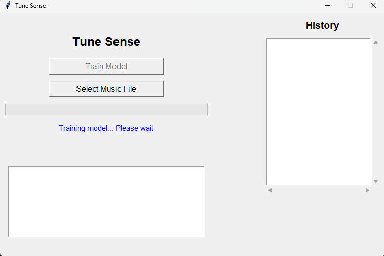
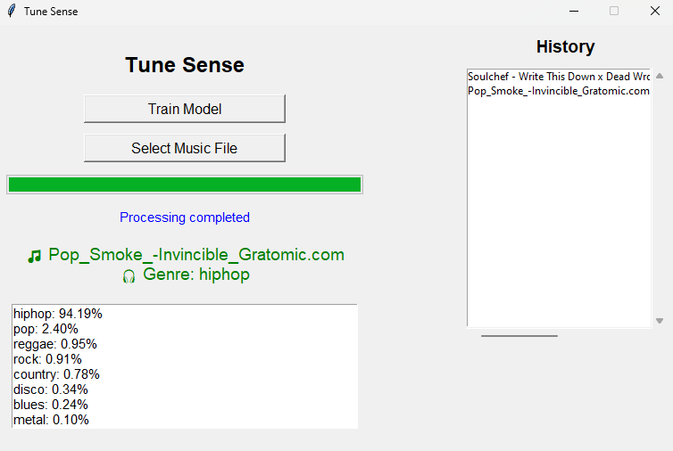

<div dir="rtl" lang="fa">

# 🎵 Tune Sense

**سیستم هوشمند تشخیص ژانر موسیقی**

---

## 👥 اعضای پروژه

- علی بادپروا
- نام اعضا
- نام اعضا
- نام اعضا
- نام اعضا

---

## 📌 معرفی پروژه

Tune Sense یک سیستم هوشمند برای تشخیص ژانر موسیقی است که با تحلیل فایل‌های صوتی، ژانر را با استفاده از تکنیک‌های یادگیری ماشین و استخراج ویژگی‌های مبتنی بر یادگیری عمیق پیش‌بینی می‌کند.

- از **Embeddingهای مدل از پیش آموزش‌دیده <span dir="ltr">YAMNet</span>** برای استخراج ویژگی‌های معنایی صوت استفاده می‌شود.
- سپس یک **مدل <span dir="ltr">Support Vector Machine (SVM)</span>** برای دسته‌بندی ژانرها آموزش داده می‌شود.
- رابط کاربری گرافیکی (<span dir="ltr">GUI</span>) جهت تعامل ساده و مؤثر با سیستم پیاده‌سازی شده است.

---

## 🧠 ایده و منطق اصلی پروژه

- به‌جای ویژگی‌های سنتی صوتی (مثل MFCC)، از **<span dir="ltr">YAMNet</span>** برای استخراج embeddingهای سطح بالا استفاده می‌شود.
- <span dir="ltr">YAMNet</span> یک مدل CNN آموزش‌دیده روی **AudioSet گوگل** است که ویژگی‌های معنایی صوت را استخراج می‌کند.
- خروجی <span dir="ltr">YAMNet</span> به مدل <span dir="ltr">SVM</span> داده می‌شود تا ژانر موسیقی پیش‌بینی شود.

**مزیت این ترکیب:**

- استفاده از قدرت مدل‌های عمیق
- آموزش سریع، سبک و قابل کنترل

---

## 🎯 قابلیت‌ها

- انتخاب فایل صوتی (`.wav` یا `.mp3`)
- استخراج خودکار ویژگی‌های صوتی معنادار
- پیش‌بینی ژانر موسیقی با مدل آموزش‌دیده
- نمایش درصد اطمینان (Confidence) هر ژانر
- مشاهده تاریخچهٔ فایل‌های تحلیل‌شده
- آموزش مدل از داخل رابط گرافیکی بدون نیاز به ترمینال

---

## 📂 توضیح فایل‌ها

**feature_extraction.py**

- استخراج ویژگی‌های صوتی کلاسیک: MFCC، Chroma، Spectral Contrast، Tempo، Mel Spectrogram
- بیشتر برای مقایسه و توسعه روش‌های استخراج ویژگی

**predict.py**

- هستهٔ منطق پیش‌بینی ژانر
- بارگذاری lazy مدل (Load only when needed)
- استخراج ویژگی با <span dir="ltr">YAMNet</span>
- نرمال‌سازی ویژگی‌ها با <span dir="ltr">scaler</span> ذخیره‌شده
- پیش‌بینی ژانر با <span dir="ltr">SVM</span>
- محاسبه confidence برای هر ژانر
- خطای کنترل‌شده در صورت نبود مدل آموزش‌دیده

**train_model.py**

- خواندن دیتاست (هر فولدر = یک ژانر)
- استخراج embedding صوتی با <span dir="ltr">YAMNet</span>
- انکد (Encode) لیبل‌های ژانر
- نرمال‌سازی ویژگی‌ها
- تقسیم داده به <span dir="ltr">train</span> و <span dir="ltr">test</span>
- آموزش <span dir="ltr">SVM</span> با:
  - kernel = RBF
  - probability = True
  - class_weight = balanced
- ذخیره مدل، scaler و label encoder
- قابل اجرا هم از ترمینال هم از <span dir="ltr">GUI</span>

**ui.py**

- رابط کاربری گرافیکی با <span dir="ltr">Tkinter</span>
- انتخاب فایل موسیقی و اجرای پیش‌بینی
- نمایش ژانر و درصد اطمینان
- نمایش تاریخچهٔ آهنگ‌ها و نوار پیشرفت
- اجرای آموزش مدل در Thread جدا برای جلوگیری از فریز UI
- نمایش خطاها به‌صورت MessageBox

---

## 🧪 جزئیات آموزش مدل

- مدل استخراج ویژگی: **<span dir="ltr">YAMNet</span>** (TensorFlow Hub)
- مدل دسته‌بندی: **<span dir="ltr">SVM</span>** (کرنل RBF)
- متعادل‌سازی کلاس‌ها: فعال
- ارزیابی: تقسیم داده به Train و Test
- بارگذاری هوشمند: فقط در زمان نیاز

**نتایج نمونه آموزش:**

- دقت روی دادهٔ آموزش: ~99٪
- دقت روی دادهٔ تست: ~88–90٪

---

# 🧰 کتابخانه‌های استفاده‌شده

در ادامه جدولی از کتابخانه‌های اصلی پروژه همراه با کاربرد/دلیل استفاده آورده شده است:

| کتابخانه                                                        | کاربرد / دلیل استفاده                                                                                                                                                                     |
| --------------------------------------------------------------- | ----------------------------------------------------------------------------------------------------------------------------------------------------------------------------------------- |
| <code dir="ltr">librosa</code>                                  | بارگذاری و پردازش فایل‌های صوتی، تغییر نرخ نمونه‌برداری، استخراج ویژگی‌های کلاسیک صوت (MFCC, Chroma, Spectral Contrast, Mel Spectrogram, Tempo)                                           |
| <code dir="ltr">numpy</code>                                    | پردازش عددی و محاسبات ماتریسی روی ویژگی‌های استخراج‌شده، میانگین‌گیری embeddingها                                                                                                         |
| <code dir="ltr">tensorflow_hub</code>                           | بارگذاری مدل از پیش آموزش‌دیده <span dir="ltr">YAMNet</span> برای استخراج embedding‌های سطح بالا و معنایی از صوت                                                                          |
| <code dir="ltr">joblib</code>                                   | ذخیره و بارگذاری سریع مدل‌های <span dir="ltr">SVM</span>، <span dir="ltr">scaler</span> و <span dir="ltr">label encoder</span>؛ جایگزین سبک‌تر و سریع‌تر از <code dir="ltr">pickle</code> |
| <code dir="ltr">os</code>                                       | مدیریت مسیرها و فایل‌ها، بررسی وجود فایل و فولدر، ساخت فولدرهای پروژه                                                                                                                     |
| <code dir="ltr">subprocess</code>                               | اجرای اسکریپت آموزش مدل (<code dir="ltr">train_model.py</code>) از داخل UI به صورت مستقل                                                                                                  |
| <code dir="ltr">threading</code>                                | اجرای عملیات طولانی (مثل آموزش مدل) در Thread جدا برای جلوگیری از فریز شدن رابط کاربری                                                                                                    |
| <code dir="ltr">sklearn.preprocessing.LabelEncoder</code>       | تبدیل برچسب‌های ژانر (string) به مقادیر عددی برای مدل <span dir="ltr">SVM</span>                                                                                                          |
| <code dir="ltr">sklearn.preprocessing.StandardScaler</code>     | نرمال‌سازی ویژگی‌ها قبل از آموزش مدل و پیش‌بینی برای ثبات عملکرد                                                                                                                          |
| <code dir="ltr">sklearn.model_selection.train_test_split</code> | تقسیم داده‌ها به مجموعهٔ آموزش و تست برای ارزیابی عملکرد مدل                                                                                                                              |
| <code dir="ltr">sklearn.svm.SVC</code>                          | مدل دسته‌بندی <span dir="ltr">SVM</span> با کرنل RBF برای تشخیص ژانر موسیقی                                                                                                               |
| <code dir="ltr">tkinter</code>                                  | ساخت رابط کاربری گرافیکی سبک و سریع بدون نیاز به کتابخانه جانبی                                                                                                                           |
| <code dir="ltr">tkinter.filedialog</code>                       | باز کردن پنجرهٔ انتخاب فایل صوتی توسط کاربر                                                                                                                                               |
| <code dir="ltr">tkinter.messagebox</code>                       | نمایش پیام‌های خطا و اطلاع‌رسانی در GUI                                                                                                                                                   |
| <code dir="ltr">tkinter.ttk</code>                              | استفاده از ویجت‌های پیشرفته Tkinter مثل Progressbar                                                                                                                                       |
| <code dir="ltr">predict (local module)</code>                   | فایل <code dir="ltr">predict.py</code> شامل توابع اصلی پیش‌بینی ژانر با <span dir="ltr">YAMNet</span> و <span dir="ltr">SVM</span>                                                        |

---

## 🖥️ نحوه اجرا

** ⚙️ پیش‌نیازها**

این پروژه با Python 3.9 یا بالاتر پیاده‌سازی شده و از کتابخانه‌های زیر استفاده می‌کند:

- NumPy برای محاسبات عددی
- Librosa برای پردازش سیگنال صوتی
- TensorFlow و TensorFlow Hub برای استفاده از مدل <span dir="ltr">YAMNet</span>
- Scikit-learn برای آموزش مدل <span dir="ltr">SVM</span>
- Joblib برای ذخیره و بارگذاری مدل‌های آموزش‌دیده

نصب وابستگی‌ها:

```bash
pip install -r requirements.txt
```

**1️⃣ آموزش مدل**  
ترمینال:

```bash
python train_model.py
```

یا از دکمهٔ <span dir="ltr">Train Model</span> در GUI

**2️⃣ اجرای برنامه**

```bash
python ui.py
```

**3️⃣ پیش‌بینی ژانر**

- انتخاب فایل صوتی
- انتظار برای پردازش
- مشاهده ژانر و درصد اطمینان
- بررسی تاریخچهٔ آهنگ‌ها در پنل کناری

</div>

## خروجی پروژه

**آموزش مدل**



**انتخاب موزیک برای پیش بینی**


